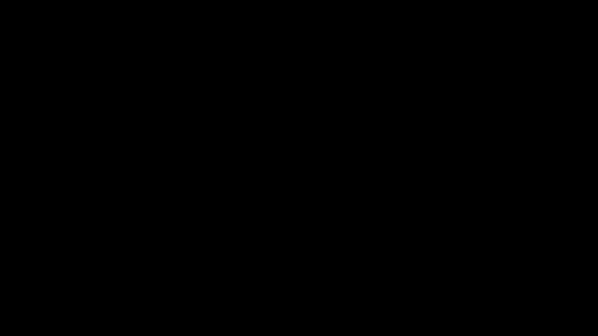

# QJL: 1-Bit Quantized JL Transform

**Authors:** Amir Zandieh, Majid Daliri, Insu Han  
**Year:** 2024  
**Venue:** AAAI Conference on Artificial Intelligence  
**Paper ID:** 7318a804566baadc9f4b4ca8255f78744e749a32

> [!NOTE]
> This page is being generated in a high-quality Wikipedia style.

## Overview
Serving Large Language Models (LLMs) requires substantial memory due to the storage requirements of Key-Value (KV) embeddings in the KV cache, which grows with sequence length. This paper introduces QJL, a quantization approach combining a Johnson-Lindenstrauss (JL) transform followed by sign-bit quantization. Unlike existing techniques, QJL eliminates memory overheads by removing the need for storing quantization constants, allowing the KV cache to be aggressively compressed while preserving model accuracy and enabling high-throughput inference for long contexts.

## Summary
The QJL (Quantized Johnson-Lindenstrauss) method tackles the substantial memory consumption of the KV cache during the token generation decoding phase of auto-regressive transformers. The core idea is to apply a 1-bit quantization mapping to vectors using a random projection matrix $\mathbf{S} \in \mathbb{R}^{m \times d}$:

$$ \mathcal{H}_S(\mathbf{k}) := \text{sign}(\mathbf{S} \cdot \mathbf{k}) $$

To achieve an unbiased estimate of the inner product of two vectors (crucial for computing attention scores $\text{softmax}(\mathbf{q}^T \mathbf{k})$ without amplifying error), QJL uses an asymmetric estimator where only the key is quantized to a single bit while the query remains unquantized:

$$ \text{Prod}_{QJL}(\mathbf{q}, \mathbf{k}) := \frac{\sqrt{\pi/2}}{m} \|\mathbf{k}\|_2 \cdot \langle \mathbf{S}\mathbf{q}, \mathcal{H}_S(\mathbf{k}) \rangle $$

The authors provide theoretical guarantees that $\text{Prod}_{QJL}$ is an unbiased estimator with bounded distortion. This method is data-oblivious, does not require fine-tuning, and uses an orthogonalized JL transform to improve empirical performance. It successfully compresses the KV cache to only 3 bits per floating-point number with virtually zero accuracy loss.

## Animation

## Glossary
| Term | Definition |
| :--- | :--- |
| **KV Cache** | Memory used in auto-regressive transformers to store previously generated key and value embeddings, preventing redundant recomputations. |
| **Johnson-Lindenstrauss (JL) Transform** | A mathematical technique involving a random projection that preserves the distances and inner products between points in a high-dimensional space. |
| **QJL Transform** | A mapping that projects a vector using a JL transform and then quantizes the result to its sign bit (1-bit). |
| **Asymmetric Estimator** | An inner product estimation technique where one vector is fully quantized while the other is kept unquantized, ensuring unbiased and low-distortion results. |

## References
- [Attention is All you Need](./204e3073870fae3d05bcbc2f6a8e263d9b72e776.md)
- [Fast Transformer Decoding: One Write-Head is All You Need](./dc52b09089704ebd6f471177474bc29741c50023.md)
- [High-throughput Generative Inference of Large Language Models with a Single GPU](./42a14d824caa3348046eb34c37e2ab7985faa7a3.md)
- [KIVI: A Tuning-Free Asymmetric 2bit Quantization for KV Cache](./a3e000e0d7f64c1d094c2a8bf6f43992cbabe91b.md)
- [KVQuant: Towards 10 Million Context Length LLM Inference with KV Cache Quantization](./b085968c4362fb286ad6c5ef71a5db9630da0498.md)
