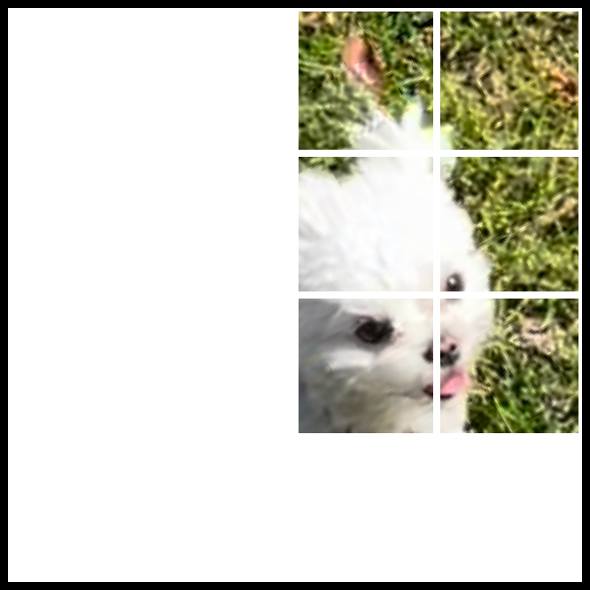
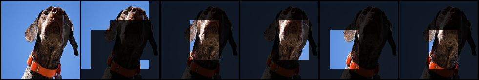
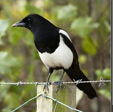
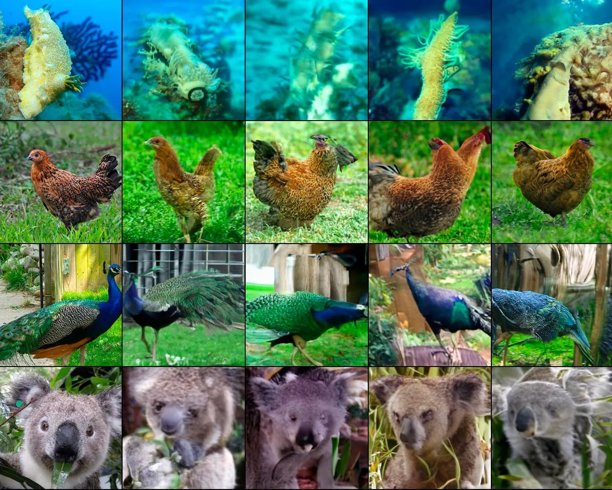

# Self-Supervised Learning from Images with a Joint-Embedding Predictive Architecture (I-JEPA)

**Authors:** Mahmoud Assran, Quentin Duval, Ishan Misra, Piotr Bojanowski, Pascal Vincent, Michael Rabbat, Yann LeCun, Nicolas Ballas  
**Year:** 2023  
**Venue:** CVPR  
**Paper ID:** ee57e4d7a125f4ca8916284a857c3760d7d378d3

> [!NOTE]
> This page is being generated in a high-quality Wikipedia style.

## Overview
This paper introduces the Image-based Joint-Embedding Predictive Architecture (I-JEPA), an approach for learning highly semantic image representations without relying on hand-crafted data augmentations. I-JEPA is a non-generative self-supervised learning technique where the model learns by predicting the representations of various target blocks in an image given a single context block. By predicting in representation space instead of pixel space, I-JEPA naturally avoids capturing unnecessary low-level details, yielding representations that are more semantic and an architecture that scales efficiently.

## Figures and Diagrams

> Key figures extracted from the original paper.

*The overall objective is as follows: given a context*

---

*Examples of our context and target-masking strategy.*

---

*Visualization of I-JEPA predictor representations. For each image: first column contains the original image; second column*

---

*Visualization of I-JEPA target-encoder representations. For each image: first column contains the original image; subsequent*

---

## Summary
The I-JEPA architecture comprises three main components: a context encoder, a target encoder, and a predictor network, all based on Vision Transformers (ViTs). Unlike generative methods such as Masked Autoencoders (MAE) that aim to reconstruct pixel-level targets, I-JEPA predicts abstract representations. Given an input image, a context block $x$ is fed through the context encoder to obtain representations $s_x$. The target encoder processes the full image to generate representations $s_y$, which are then extracted for specific target blocks $B_i$. 

The predictor network $g_{\phi}$ takes the context representations $s_x$ and positional mask tokens corresponding to the target blocks to predict the target representations:

$$\hat{s}_y(i) = g_{\phi}(s_x, {$m_j$}_{j \in B_i})$$

The model is optimized using an average $L_2$ distance loss between the predicted patch-level representation and the target patch-level representation:

$$\frac{1}{M}\sum_{i=1}^M D(\hat{s}_y(i), s_y(i)) = \frac{1}{M}\sum_{i=1}^M \sum_{j \in B_i} \|\hat{s}_{y_j} - s_{y_j}\|_2^2$$

To prevent representation collapse, I-JEPA relies on an asymmetric design where the target encoder's weights are updated as an exponential moving average (EMA) of the context encoder's weights. A critical design choice is the multi-block masking strategy, which ensures the target blocks are large enough to contain semantic information and the context is informative but sparse.

## Glossary
| Term | Definition |
| :--- | :--- |
| **Joint-Embedding Predictive Architecture (JEPA)** | A self-supervised framework where a predictor network learns to map representations of a context signal to the representations of target signals in an abstract embedding space. |
| **Representation Collapse** | A failure mode in joint-embedding architectures where the encoder ignores the input and outputs a constant vector, artificially minimizing the distance between pairs. |
| **Exponential Moving Average (EMA)** | An update mechanism where the weights of a target network smoothly track the weights of the online network over time, preventing collapse in self-supervised learning. |
| **Multi-Block Masking** | A masking strategy that samples multiple, potentially overlapping target blocks and a single, spatially disjoint context block to force the model to learn semantic dependencies rather than trivial local continuities. |

## References
- [A path towards autonomous machine intelligence version 0.9. 2, 2022-06-27](./775f42ed458b8c5b0f2094ea4ff5b64c557b1a34.md)
- [Masked autoencoders are scalable vision learners](./36e52296b5a19000a6e87f654b7b3ee42a5ea79c.md)
- [Emerging properties in self-supervised vision transformers](./18b958fb359a35e8eb9f3150247fc897d103dfb3.md)
- [Data2vec: A general framework for self-supervised learning in speech, vision and language](./08c5c70fb905187771746f3661eb9f783281350a.md)
