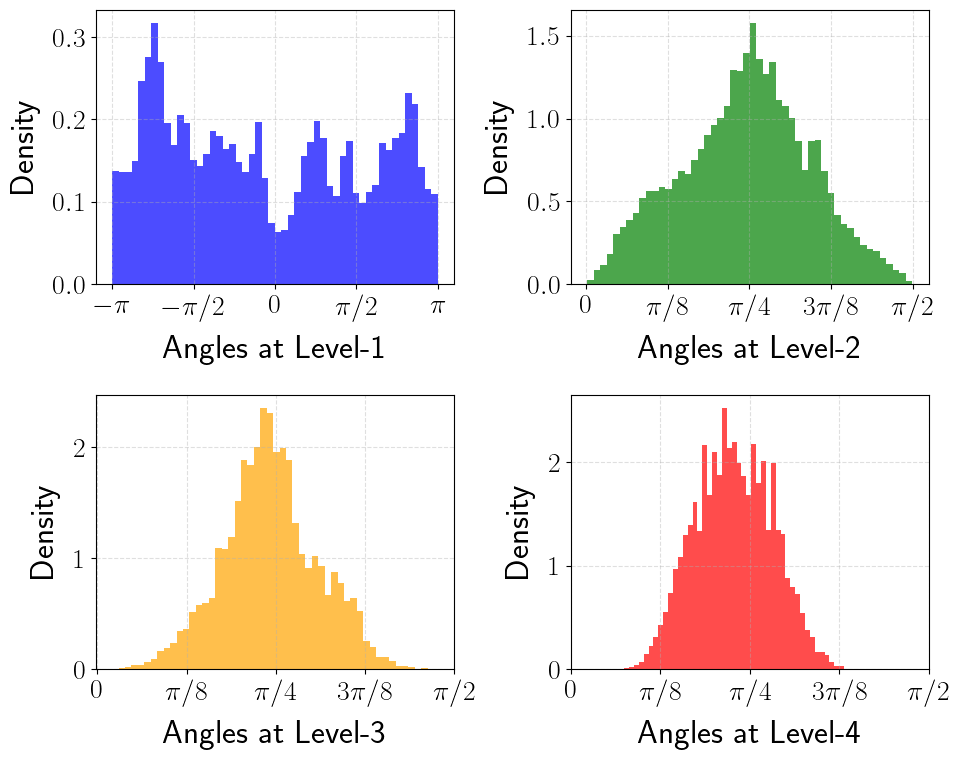
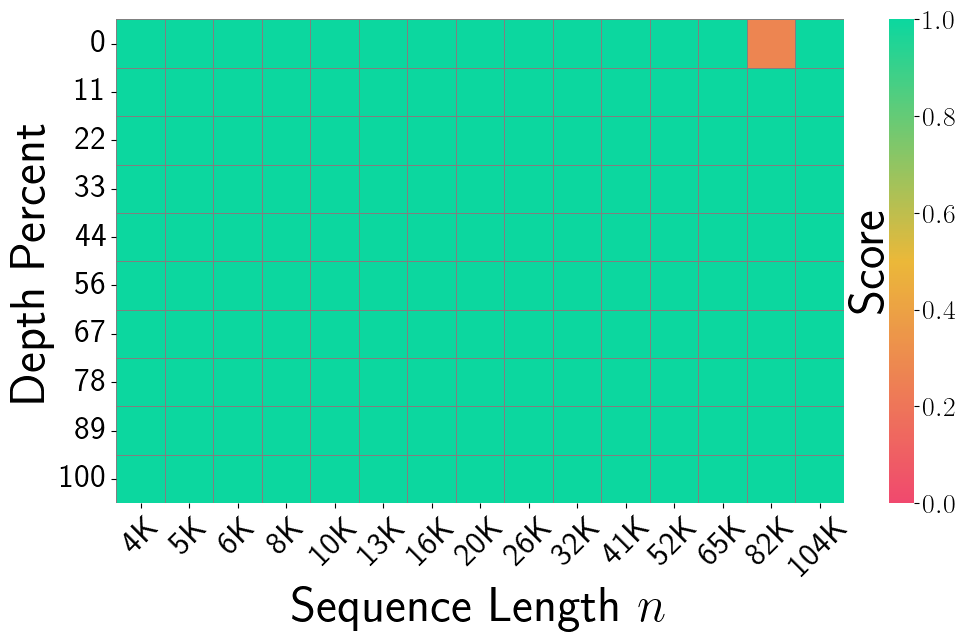

# PolarQuant: Quantizing KV Caches with Polar Transformation

**Authors:** Insu Han, Praneeth Kacham, Amin Karbasi, V. Mirrokni, A. Zandieh
**Year:** 2025
**Venue:** arXiv.org
**Paper ID:** ef9485a2522f64bca0f5cf67edc28a11984790e8

> [!NOTE]
> This page is being generated in a high-quality Wikipedia style.

## Overview
This work introduces PolarQuant, a novel quantization method employing random preconditioning and polar transformation, which transforms the KV embeddings into polar coordinates using an efficient recursive algorithm and then quantizes resulting angles.

## Abstract
Large language models (LLMs) require significant memory to store Key-Value (KV) embeddings in their KV cache, especially when handling long-range contexts. Quantization of these KV embeddings is a common technique to reduce memory consumption. This work introduces PolarQuant, a novel quantization method employing random preconditioning and polar transformation. Our method transforms the KV embeddings into polar coordinates using an efficient recursive algorithm and then quantizes resulting angles. Our key insight is that, after random preconditioning, the angles in the polar representation exhibit a tightly bounded and highly concentrated distribution with an analytically computable form. This nice distribution eliminates the need for explicit normalization, a step required by traditional quantization methods which introduces significant memory overhead because quantization parameters (e.g., zero point and scale) must be stored in full precision per each data block. PolarQuant bypasses this normalization step, enabling substantial memory savings. The long-context evaluation demonstrates that PolarQuant compresses the KV cache by over x4.2 while achieving the best quality scores compared to the state-of-the-art methods.

## Figures and Diagrams

> Key figures extracted from the original paper.

*Distributions of angles of polar transformed key embeddings (a) with and (b) without*

---

*Needle-In-A-Haystack test using Llama-3.1-8B-Instruct. The test spans different depths*

---

## Summary
(The LLM agent will populate this section with a detailed, structured summary including equations and figure references)

## Glossary
(The LLM agent will populate this section with technical terms and definitions)

## References
No references found.

--- 
*Generated from: han2025polarquant.pdf*